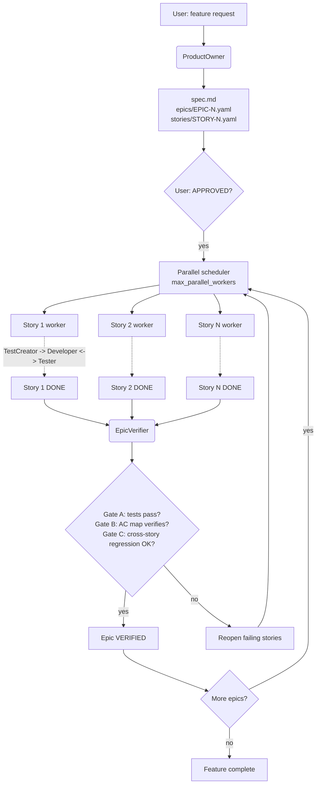

# Sage Feature Team

A multi-agent feature-development workflow for Claude Code. Generic agents
(ProductOwner, TestCreator, Developer, Tester, EpicVerifier) coordinated by a
skill acting as Team Lead. Project-specific knowledge lives in each project's
`.sage/` directory.

> **What this is, and what it isn't.** This is a pattern built against Claude
> Code's primitives -- `Agent`, `Task`, `SendMessage`, `TeamCreate`,
> `shutdown_request`, `Monitor`. The *ideas* port well to other agentic
> environments: ephemeral per-story workers, YAML as the event log instead of
> the message body, three verification gates instead of one, mechanical
> scheduling instead of LLM-judged routing. The *code* does not. If you're not
> using Claude Code, treat this repo as a reference design, not a drop-in
> framework.

---

## Quickstart (5 minutes)

From a fresh clone to a live agent team drafting a spec for you.

**1. Install** (one-time per machine):

```bash
pip install -r requirements.txt
python _tools/install_skill.py
```

**2. Kick off a feature.** This repo ships with a ready-to-run example config
(`sage-config.yaml`, pointed at the bundled `examples/static-site-generator/`).
From the repo root, in Claude Code:

```
/sage-feature-team "Add a /help command that lists available commands"
```

A team spins up and the **ProductOwner** starts drafting the spec. Watch the
team panel populate -- and once you approve the spec, the parallel
**TestCreator / Developer / Tester** workers join it, one per story:


**3. Approve the spec.** When the ProductOwner reports the spec is ready, reply
`APPROVED`. A spec, at least one epic, and one YAML file per story land under
`_output/`:

```
_output/add_help_command/
+-- spec.md
+-- epics/EPIC-1.yaml
+-- stories/STORY-1.yaml, STORY-2.yaml, ...
```


That's the on-ramp. From here the team cycles each story through
tests -> code -> validation in parallel until every epic verifies.

---

## Use sage with your own project

The Quickstart above runs against the bundled `examples/static-site-generator/`.
To point these same agents at *your own* codebase, `cd` to that project's
repo root in Claude Code and run:

```
/sage-install
```

`/sage-install` scaffolds `.sage/` (the per-agent config files, the agent
role files, the helper scripts, the handbook, the templates) and
`.claude/skills/` (the six sage skills, with paths rewritten to point at the
project's `.sage/`) into your project. After it completes, edit each
`.sage/sage-<role>-config.yaml` to give the agents your project's HOW
(testing conventions, file layout, code-style docs to consult), then run
`/sage-feature-team "feature description"` from your project root.

For prereqs, manual install path, diagnostic notes, and the full
what-gets-installed-where tree, see **[docs/INSTALL.md](docs/INSTALL.md)**.

> Just want the spec without spawning a team? Try `/sage-po "..."` -- the
> ProductOwner inline, no team panel. The single-agent skills section below
> covers this.

---

## Try a single agent first

Before spinning up the full team, run one agent inline. The single-agent
skills act as the agent directly in the main conversation -- no team panel,
no orchestrator overhead, no async coordination. It's the fastest way to
get a feel for what each role does.

From the repo root, in Claude Code:

```
/sage-po "Add a /help command that lists available commands"
```

The ProductOwner drafts a spec and per-story YAMLs inline; the output lands
under `_output/<feature_name>/`. From there you can read what it produced,
pick the work back up later with `/sage-test-creator`, `/sage-developer`, or
`/sage-tester`, or hand it to the full team with `/sage-feature-team` once
you've approved the spec.

The same pattern works for any role -- `/sage-developer` will pick up the
next `IN_DEV` story; `/sage-tester` will run the next `TESTING` one. See
[Inline single-agent skills](#inline-single-agent-skills) below for the full
per-skill reference.

---

## How it flows



Three verification gates run before a feature is complete:

- **Gate A** -- per-story tests pass (run by Tester after each Developer cycle).
- **Gate B** -- the AC implementation map (`verify_ac_map.py`) confirms every
  acceptance criterion is wired to real code, not just to a passing test.
- **Gate C** -- the EpicVerifier runs cross-story regression once every story
  in an epic is `DONE`, then flips the epic to `VERIFIED`. Downstream epics
  with `depends_on:` only unblock at `VERIFIED`, not `DONE`.

If GitHub didn't render the Mermaid above (older clients sometimes don't),
here's the same diagram as a static image:
[docs/img/architecture.svg](docs/img/architecture.svg) (or the
[high-res PNG](docs/img/architecture@2x.png) for sharing).

---

## Inline single-agent skills

Reference for the inline skills introduced in
[Try a single agent first](#try-a-single-agent-first). Each runs the agent
directly in the main conversation -- no team panel, no orchestrator overhead.

| Skill | Picks up | Override |
|---|---|---|
| `/sage-po "<feature description>"` | n/a -- creates a new spec + stories file | `--feature <name>` to set feature_name explicitly |
| `/sage-test-creator [STORY-N]` | Next story at `TODO` whose dependencies are all `DONE` | Pass `STORY-N` to target a specific story |
| `/sage-developer [STORY-N]` | Next story at `IN_DEV` | Pass `STORY-N` to target a specific story |
| `/sage-tester [STORY-N] [--full]` | Next story at `TESTING` (story-scoped tests) | `STORY-N` to target a specific story; `--full` for regression |

All four also accept `--feature <feature_name>` if multiple feature folders
exist under `_output/`. Otherwise the feature is auto-detected (single
match) or the skill asks the user (multiple matches).

---

## Where to go from here

- **[docs/INSTALL.md](docs/INSTALL.md)** -- install sage into your own
  project (the bundled example is covered by the Quickstart above).
  Prerequisites, the `/sage-install` flow, the manual install path, the
  dependency story, and what to do when something doesn't preflight.
- **[docs/ARCHITECTURE.md](docs/ARCHITECTURE.md)** -- the design rationale:
  the generic-WHAT / project-specific-HOW split, the state machine, the
  three-gate model, the scheduler model, the file reference, and how to
  add a new agent.
- **[HANDBOOK.md](HANDBOOK.md)** -- the agent protocol in full: completion
  reporting, escalation, Monitor usage, timeouts, SendMessage discipline.
- **[examples/static-site-generator/](examples/static-site-generator/)** --
  a real end-to-end run: the implementation sage produced plus all run
  artifacts under `_output/` (spec, epics, stories, verification reports,
  token telemetry).
