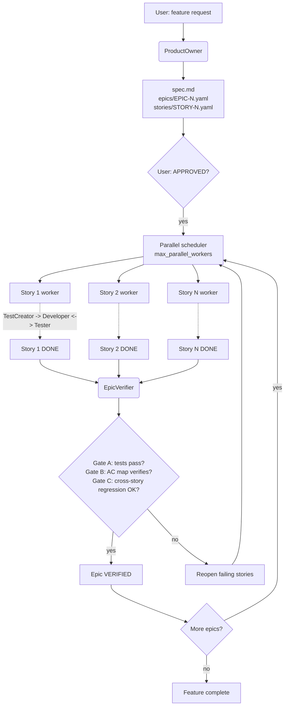

# Sage Feature Team

[](https://androidweekly.net/issues/issue-731)


A multi-agent feature-development workflow for Claude Code. Generic agents
(ProductOwner, TestCreator, Developer, Tester, EpicVerifier) coordinated by a
skill acting as Team Lead. Project-specific knowledge lives in each project's
`.sage/` directory.

> **What this is, and what it isn't.** This is a pattern built against Claude
> Code's primitives -- `Agent`, `Task`, `SendMessage`, `TeamCreate`,
> `shutdown_request`, `Monitor`. The *ideas* port well to other agentic
> environments: ephemeral per-story workers, YAML as the event log instead of
> the message body, three verification gates instead of one, mechanical
> scheduling instead of LLM-judged routing. The *code* does not. If you're not
> using Claude Code, treat this repo as a reference design, not a drop-in
> framework.

---

## Quickstart (5 minutes)

From a fresh clone to a feature spec drafted by your first sage agent.

**1. Install** (one-time per machine):

```bash
pip install -r requirements.txt
python _tools/install_skill.py
```

**2. Invoke the ProductOwner inline.** This repo ships with a bundled example
project (`examples/static-site-generator/` -- a small Markdown-to-HTML site
builder) that the demo config points at. From the repo root, in Claude Code:

```
/sage-po "Add an RSS feed at /feed.xml listing the 20 most recent posts sorted by date"
```

`/sage-po` runs the ProductOwner agent inline in the main conversation -- no
team panel, no async coordination. After a few minutes you'll see new files
under `_output/`:

```
_output/add_rss_feed/
+-- spec.md
+-- epics/EPIC-1.yaml
+-- stories/STORY-1.yaml, STORY-2.yaml, ...
```

The spec, one epic, and one YAML per story. Open `spec.md` for the
human-readable version and the `STORY-N.yaml` files for the per-story
acceptance criteria that downstream agents work against. That's the
on-ramp -- the rest of sage is what happens when you hand these stories
off to the team.

> **Want to see what a *finished* run looks like instead of running one?**
> The bundled example already has a complete run committed: browse
> [`examples/static-site-generator/_output/static_site_generator/`](examples/static-site-generator/_output/static_site_generator/)
> for the spec, all 8 story YAMLs + their `STORY-N.implementation.md`
> sidecars (Developer's AC map), the three `verification/EPIC-N.md` reports
> (EpicVerifier output), and `tokens.md` (per-worker token telemetry). No
> install required.

---

## Going further

Once you've seen the PO output, three natural next steps:

- **Continue with inline single-agent skills.** Pick up the work yourself
  one role at a time: `/sage-test-creator` writes tests for the next ready
  story, `/sage-developer` implements code for the next `IN_DEV` story,
  `/sage-tester` verifies the next `TESTING` story (story-scoped tests,
  plus the AC implementation map gate). The
  [reference table below](#inline-single-agent-skills) lists each one with
  its picks-up rule.
- **Run the full team.** `/sage-feature-team "<feature description>"`
  spawns ProductOwner + TestCreator + Developer + Tester + EpicVerifier and
  routes work through a parallel scheduler until every epic verifies. You'll
  see a team panel populate with one worker per story. Heavier than the
  inline path; see [How it flows](#how-it-flows) below for the full
  pipeline.
- **Use sage with your own project.** From your project's repo root, run
  `/sage-install`. The installer scaffolds `.sage/` and `.claude/skills/`
  into your project, with paths rewritten so the skills point at your
  project's bundled copies. Then edit each `.sage/sage-<role>-config.yaml`
  with your project's testing conventions, file layout, and code-style
  docs. Full walkthrough: **[docs/INSTALL.md](docs/INSTALL.md)**.

---

## How it flows



Three verification gates run before a feature is complete:

- **Gate A** -- per-story tests pass (run by Tester after each Developer cycle).
- **Gate B** -- the AC implementation map (`verify_ac_map.py`) confirms every
  acceptance criterion is wired to real code, not just to a passing test.
- **Gate C** -- the EpicVerifier runs cross-story regression once every story
  in an epic is `DONE`, then flips the epic to `VERIFIED`. Downstream epics
  with `depends_on:` only unblock at `VERIFIED`, not `DONE`.

If GitHub didn't render the Mermaid above (older clients sometimes don't),
here's the same diagram as a static image:
[docs/img/architecture.svg](docs/img/architecture.svg) (or the
[high-res PNG](docs/img/architecture@2x.png) for sharing).

---

## Inline single-agent skills

Reference for the inline skills mentioned in
[Going further](#going-further). Each runs the agent directly in the main
conversation -- no team panel, no orchestrator overhead.

| Skill | Picks up | Override |
|---|---|---|
| `/sage-po "<feature description>"` | n/a -- creates a new spec + stories file | `--feature <name>` to set feature_name explicitly |
| `/sage-test-creator [STORY-N]` | Next story at `TODO` whose dependencies are all `DONE` | Pass `STORY-N` to target a specific story |
| `/sage-developer [STORY-N]` | Next story at `IN_DEV` | Pass `STORY-N` to target a specific story |
| `/sage-tester [STORY-N] [--full]` | Next story at `TESTING` (story-scoped tests) | `STORY-N` to target a specific story; `--full` for regression |

All four also accept `--feature <feature_name>` if multiple feature folders
exist under `_output/`. Otherwise the feature is auto-detected (single
match) or the skill asks the user (multiple matches).

---

## Where to go from here

- **[docs/INSTALL.md](docs/INSTALL.md)** -- install sage into your own
  project (the bundled example is covered by the Quickstart above).
  Prerequisites, the `/sage-install` flow, the manual install path, the
  dependency story, and what to do when something doesn't preflight.
- **[docs/ARCHITECTURE.md](docs/ARCHITECTURE.md)** -- the design rationale:
  the generic-WHAT / project-specific-HOW split, the state machine, the
  three-gate model, the scheduler model, the file reference, and how to
  add a new agent.
- **[HANDBOOK.md](HANDBOOK.md)** -- the agent protocol in full: completion
  reporting, escalation, Monitor usage, timeouts, SendMessage discipline.
- **[examples/static-site-generator/](examples/static-site-generator/)** --
  a real end-to-end run: the implementation sage produced plus all run
  artifacts under `_output/` (spec, epics, stories, verification reports,
  token telemetry).
